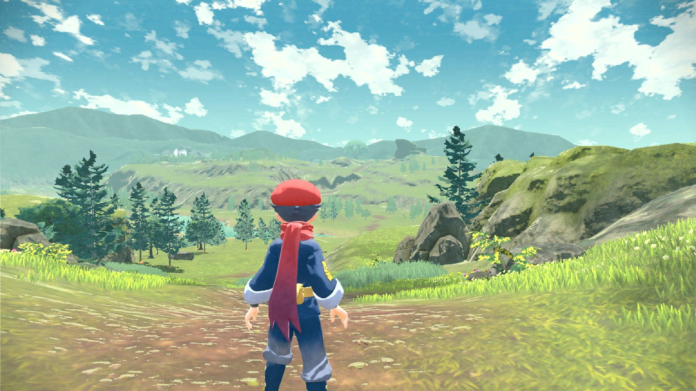
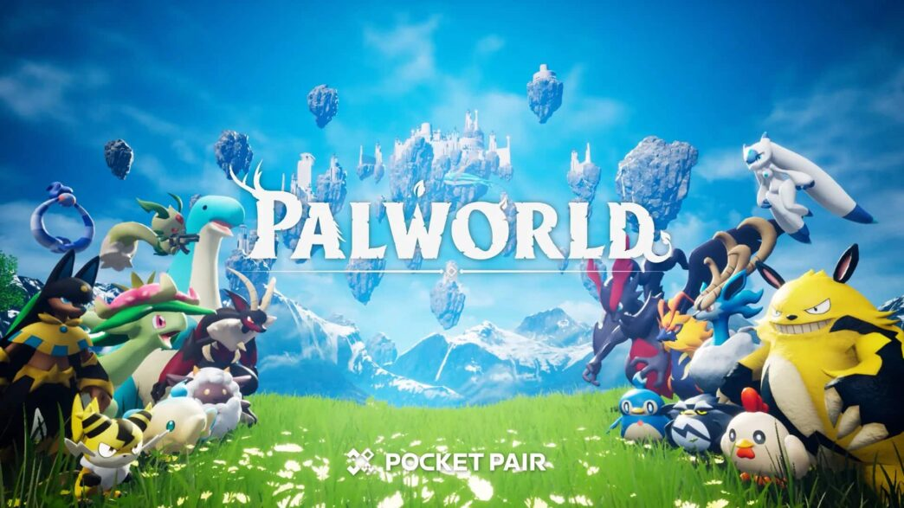
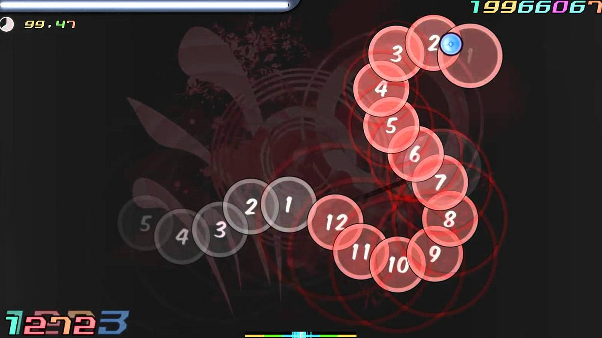
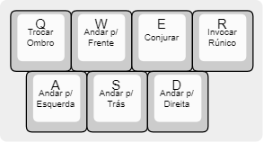

# Game Design Document (GDD)

# Capsturing

**Aluno:** Nicolas Robert de Oliveira Borges  
**Email:** nicolas.borges@catolicasc.edu.br  

**Status do Projeto:**
Prototipagem

**Versão de Documento:** v0.4  
**Última Atualização:** 25/08/2026

# 1. Visão Geral

## Elevator Pitch

Um jogo 3D de captura de monstro, onde o jogador usa magia para capturar e treinar criaturas sobrenaturais que se tornarão seus aliados em exploração e combate.

## Gênero
- Captura de monstro
- Exploração
- Ação
- Ritmo

## Público Alvo

Jogadores em busca de algo que compense habilidade dentre 16 a 35 anos.

## Plataformas

- PC

# 2. Acesso ao Projeto

| Item | Link |
|-----|-----|
| Build jogável | Itch.io / Download |
| Repositório | GitHub |
| Instruções de execução | Requisitos técnicos |

# 3. Pesquisa e Referências

## Jogos de Referência

- Pokemon

- Palworld

- Osu

## Análise das Referências

Ambos Pokemon e Palworld compartilham do mesmo gênero base de jogo de captura de monstros. Pokemon é famoso por seus designs icônicos e charmosos, e recompensa estratégia em como o jogador faz uso dos traços e capacidades individuais de seus monstros, enquanto Palworld possui mecânicas de gameplay divertidas em como o jogador participa do combate ao lado de seus companheiros. Osu, um jogo de ritmo, é a inspiração principal para as mecânicas de magia de Capsturing, exigindo foco e destreza, para jogar e garantindo bons desafios aos jogadores com sua gameplay punitiva mas que garante uma sensação de triumfo quando se obtem sucesso.

# 4. Hipótese de Design

| Hipótese | Método de Teste |
|-----|-----|
| Jogadores preferem mecânicas que testem sua habilidade a chance aleatória | Playtest comparando captura baseada em ritmo vs captura puramente probabilísticaPlaytest com mecânica de captura que requer um nivel de habilidade |
| Jogadores conseguem aprender o sistema de captura baseado em ritmo sem tutorial longo | Playtest inicial observando taxa de erro e tempo de aprendizado |
| Usar rúnicos para exploração (montarias ou habilidades) incentiva mais exploração do mapa | Telemetria ou observação do tempo gasto explorando |
| Participação ativa do personagem jogável junto de um rúnico aliado é mais satisfatório comparado a combate com apenas um ou outro | Observação de reação e feedback após capturas ou combates difíceis |

## Pilares do jogo
- **Habilidade acima de sorte**: a captura e o combate recompensam precisão e timing do jogador, não apenas estatísticas ou chance pura.
- **Combate compartilhado**: o jogador participa ativamente do combate ao lado do rúnico aliado, em vez de apenas observar ou comandar de longe.
- **Exploração motivada por rúnicos**: encontrar e capturar novos rúnicos é o principal motor que leva o jogador a explorar o mapa.
- **Progressão através de vínculo**: capturar não é o fim — treinar e desenvolver os rúnicos capturados é parte central da progressão do jogador.

# 5. Gameplay

## Core Loop

Explorar -> Enfrentar ou capturar rúnicos selvagens -> Treinar rúnicos -> Desenvolver novas melhorias -> Continuar Explorando

## Loops Secundários
- **Loop de captura**: apontar/travar em rúnico selvagem → conjurar feitiço de captura → minigame de preparo → minigame de captura → sucesso (rúnico vai para party ou boxStorage) ou falha (rúnico permanece selvagem).
- **Loop de combate**: identificar ameaça → comandar rúnico aliado (atacar/desviar/defender) ou agir diretamente → gerenciar HP do jogador e do rúnico → resolver combate.
- **Loop de gerenciamento de coleção**: revisar rúnicos capturados (party + boxStorage) → organizar/trocar rúnico ativo → acompanhar progressão individual.

## Mecânicas Principais

| Mecânica | Descrição |
|-----|-----|
| Movimentação | Andar, correr, pular, montarias |
| Combate | Convocar e comandar rúnico, desviar |
| Interação | Feitiços |

## Camera
Câmera em terceira pessoa sobre o ombro (shoulder camera), com pivot que segue a posição do jogador sem herdar sua rotação. O jogador pode alternar o lado do ombro (tecla Q) e ajustar o campo de visão via zoom (botão direito do mouse ou durante a mira de feitiços), que aproxima suavemente a câmera. A câmera possui detecção de colisão via sphere cast contra o cenário, ajustando a distância automaticamente para evitar clipping.

## Regras do Jogo

**Vitória**

Capturar um rúnico de alta raridade.

**Derrota**

HP cai para 0.

**Progressão**

Capturar novos rúnicos, treinar rúnicos capturados, desbloquear novas melhorias

# 6. Escopo do Projeto

## Inclui

- Ao menos 3 regiões para explorar
- Ao menos 12 tipos de rúnicos diferentes
- 3 rúnicos únicos de alta raridade
- Sistema de Captura de rúnicos
- Armazenamento de rúnicos em save local por json

## Não Inclui

- Sistema de crafting
- Multiplayer
- Geração Procedural
- Mecânicas de sobrevivência
 
# 7. Prototipagem

| Protótipo | Objetivo | Resultado |
| Movimento Básico | Validar Controle | Sob ajustes |
| Minigame de ritmo | Testar timing | Sob ajustes |
| Entidade Seguidora do Player | Testar pathfinding | Satisfatório |

## Enredo Base
O personagem jogável, um frágil praticante de magia que visa se tornar um verdadeiro mago, se especializa na arte arriscada e pouco desenvolvida de monsturgia, uma arte de domar e trabalhar com monstros mágicos, chamados rúnicos em seu mundo, que existem fora da lei natural dos animais com habilidades e características sobrenaturais. 

Para que o protagonista se torne um verdadeiro mago, ele precisa demonstrar um nível de aptidão em sua área de estudo através de algum feito considerável relacionado a sua área, e como foi instruído por seu mestre mago, para isto, ele precisará demonstrar que pode domar e treinar algum tipo de rúnico extraordinário, que apenas um professional poderia, como demonstração de estar pronto para estar intitulado de mago.

## Mecânicas do Jogo (RF)
* Movimentação & Exploração: O jogador corre, pula e escala através de um mundo 3D aberto para explorar.
* Combate: O jogador pode ser atacado por, ou atacar, um rúnico, no qual caso sua opção principal sera comandar um rúnico próprio para lutar. O jogador pode tanto desviar para evitar ataques quanto comandar seu rúnico aliado a desviar, comandá-lo a atacar diretamente ou manter-se na defensiva, e pode comandar o rúnico aliado a usar alguma habilidade disponível.
* Captura: O jogador pode capturar um rúnico ao utilizar um feitiço de captura, oque inicia um mini-jogo de ritmo com em que se deve seguir comandos demonstrados de cliques com mouse e tecla sensiveis a timing e, para o mouse, posicionamento, com a precisão no mini-jogo adicionando à probabilidade de o feitiço de captura ter sucesso. Por padrão, durante o combate isto deixa o jogador seguro a ataques de outros rúnicos que estejam em combate com o player ao pausar o combate. Nas configurações pode-se escolher entre (A) o combate continuar sem pausa, (B) o combate pausar durante a conjuração do feitiço de captura ou (C) o combate pausar durante a conjuração de qualquer feitiço.

# 8. Interface (UI/UX)
## HUD
- Barra de Vida de Player
- Barra de Vida de Rúnico
- Habilidades de Rúnico
- Seletor de Feitiço
- Seletor de Rúnico
- Minigame de Conjuração

## Menus
- Menu Principal
- Pause
- Game Over
- Configurações
- Inventário
- Menu de Rúnicos
- Menu de Feitiços

## Flow de Menus

## Controles

# 9. Direção Visual

## Direção de Arte
Estilo Fantasia e Cartoon / Anime

---

## Referências Visuais

---

# 10. Áudio

Tipos de áudio utilizados:

- música de fundo
- efeitos sonoros
- sons de animais

---

# 11. Animação

- Animação de Andar
- Animação de Correr
- Animação de Pulo
- Animação de Conjuração
- Animação de Desvio
- Animação de Dano
- Animação de Rúnicos

---

# 12. Arquitetura de Software

A arquitetura segue o princípio de responsabilidade única (SRP), com scripts 
organizados em camadas: Input/Controle (PlayerController, CameraController), 
Coordenação de sistemas (CastingGameScript como coordinator central do minigame), 
Dados (ScriptableObjects como TargetMapAsset para dados pré-gerados e imutáveis 
em runtime), e UI/Feedback (FeedBackUI, ComboCounter, CastingPercentageCounterScript). 
O sistema de spawn do minigame usa o padrão Strategy, com duas implementações 
intercambiáveis (TargetSpawner aleatório e TargetMapPlayer baseado em mapa). 
A comunicação entre componentes ocorre via chamadas diretas ao coordinator, 
mantendo os subsistemas desacoplados entre si.

Para o comportamento dos rúnicos, está planejada a implementação de Máquinas de 
Estado Finito (FSM), com estados como Patrulha, Perseguição, Ataque e Fuga. 
Cada rúnico compartilhará a mesma estrutura de FSM, variando parâmetros individuais 
(raio de visão, agressividade, velocidade, limiar de HP para fuga) e podendo ter 
comportamentos de ataque específicos dentro do estado Ataque, permitindo escalar os 
12 tipos de rúnicos sem reescrever a lógica de decisão para cada um. Caso o escopo 
de comportamentos cresça, a FSM pode ser evoluída para Behavior Trees.

Com a evolução do protótipo, os scripts que antes representavam separadamente o 
comportamento de inimigo (EnemyScript) e o de entidade seguidora (TargetFollowerBehavior) 
foram unificados em um único componente, Runic, controlado por uma enum de estado 
(RunicState: Wild, Tamed, Fainted). Essa unificação reflete a natureza do próprio 
sistema: um rúnico selvagem e um rúnico aliado são a mesma entidade em estágios 
diferentes de uma mesma relação com o jogador, então não fazia sentido mantê-los 
como classes separadas que duplicavam lógica de captura, corrente e dano. A 
ramificação de comportamento (perseguir vs. seguir, capturável vs. não) agora 
acontece dentro do próprio Update() do Runic, checando o estado atual — o que exige 
atenção redobrada ao valor padrão da enum (ver Seção 17) para evitar comportamento 
silenciosamente incorreto.

Iniciou-se também a primeira camada de persistência do projeto, via SaveManager 
(singleton com DontDestroyOnLoad) serializando dados de rúnicos capturados 
(RunicSaveData, agrupados em party e boxStorage dentro de SaveDataContainer) para 
JSON local em Application.persistentDataPath. O fluxo de Runic.Capture() converte 
a instância ativa em cena para essa estrutura de dados, carrega o save existente, 
adiciona à party (limite de 6) ou à boxStorage, e regrava o arquivo — fechando o 
ciclo entre a spell de captura (CaptureSpellScript) e o armazenamento persistente 
de rúnicos.

---

## Tecnologias Utilizadas

| Categoria | Ferramenta |
|-----|-----|
| Engine | Unity |
| Linguagem | C# |
| Versionamento | Git + GitHub |
| Assets | Asset Store |

---

# 13. Testes e Playtests

## Playtests

Playtests com usuários serão iniciados a partir de Julho/Agosto, após a implementação
dos sistemas de captura e combate. Um protótipo será compartilhado com os 4 colegas, com foco em validar:

- Se o minigame de captura baseado em ritmo é intuitivo sem tutorial longo
  (hipótese: taxa de erro deve cair visivelmente após 2-3 tentativas de captura)
- Se a captura por habilidade é percebida como mais satisfatória do que captura
  por chance aleatória (hipótese principal do design)

O feedback será coletado por observação direta e questionário curto pós-sessão.
Caso a premissa rítmica não seja validada, o sistema será ajustado para reduzir
a complexidade do timing ou introduzir assists progressivos.

---
# 14. Cronograma

- Criar os rúnicos e seus comportamentos
- Finalizar sistema de captura
- Criar menu de rúnicos
- Criar sistema de luta entre rúnicos
- Criar sistema de feitiços
- Aplicar audio ao jogo
- Criar mapa
- Criar rúnicos raros

---
# 15. Riscos do Projeto

| Risco | Impacto | Mitigação |
|-----|-----|-----|
| performance baixa | experiência ruim | otimizar ou separar o mapa em áreas separadas |
| choque entre o estilo visual dos rúnicos e o mundo ou personagem jogável | quebra de imersão | adaptar o estilo dos rúnicos para uma mesclagem de fantasia e estilo anime |

---

# 16. Limitações Conhecidas

Por mais que seja tentador, algumas adições não poderão ser implementadas:
- sistema de árvore de habilidades
- dungeons com puzzles
- quests e NPCs

---

# 17. Decisões Importantes

Registro de mudanças relevantes durante o projeto.

| Data | Decisão | Motivo |
|-----|-----|-----|
| março | remover sistema de crafting | escopo muito grande |
| abril | adicionar dash | melhorar mobilidade |
| maio | adicionar sistema de zoom | melhora precisão para conjuração e dar comandos a rúnicos aliados |
| junho | trocar mapas dos minigames de arquivos json para ScriptableObject do Unity | facilita e deixa mais flexível a adição e edição de mapas |
| junho | por padrão, o player se torna seguro a ataques de rúnicos durante a conjuração do feitiço de captura, com o combate sendo pausando durante a conjuração, mas haverá a opção de que o combate não seja pausado ou seja pausado durante a conjuração de qualquer feitiço | mantém um nível de dificuldade e necessidade de uso estratégico do feitiço de captura durante combate com múltiplos inimigos, mas ainda mantém a opção de uma experiência mais casual e acessível |
| junho | definida FSM como padrão para comportamento de rúnicos | permite escalar os 12+ tipos de rúnicos com parâmetros variáveis sem duplicar lógica de decisão |
| agosto | unificar scripts de comportamento de criaturas em um só script com diferentes estados de comportamento | Elimina duplicação de lógica entre comportamento selvagem/aliado; um rúnico muda de papel sem trocar de componente |
| agosto | implementado sistema de save via SaveManager singleton + JSON local, com party e boxStorage | Primeira peça funcional de persistência; necessário pra fechar o loop de captura |
| agosto |	enum RunicState com default Wild faz TameAI() nunca executar se o valor não for setado manualmente no Inspector | Comportamento silencioso — sem erro, sem log; corrigido adicionando log defensivo no Start() quando NavMeshAgent está ausente |

---

# 18. Créditos

Liste assets externos utilizados.

| Recurso | Fonte | Licença |
|-----|-----|-----|
| sprites | AssetStore | EULA |
| efeitos sonoros | pixabay | CC0 |
| fontes | Eleanora Font (3IP) | EULA de uso pessoal |

---

# 19. Reflexão Final
O jogo não foi finalizado ainda
