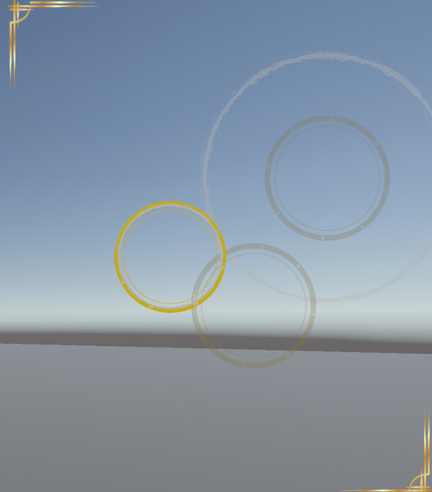
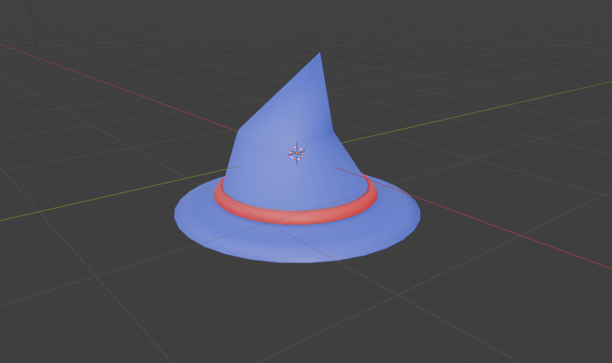

# Capsturing

Um jogo 3D de captura de monstros com foco em habilidade e ritmo, onde o jogador utiliza magia para capturar e treinar criaturas sobrenaturais.

## Sobre o Jogo
Capsturing combina mecânicas de:

* Captura de monstros
* Exploração em mundo 3D
* Combate com aliados
* Minigame de ritmo inspirado em precisão e timing

Diferente de jogos tradicionais do gênero, a captura depende da habilidade do jogador, não apenas de chance.

## Preview

  

## Como Jogar

## Game Design Document

Para detalhes completos do projeto, veja:
[GDD](GDD.md)

## Status do Projeto

Em desenvolvimento (fase de prototipagem)

## Autor
Nicolar Robert de Oliveira Borges
nicolas.borges@catolicasc.edu.br
